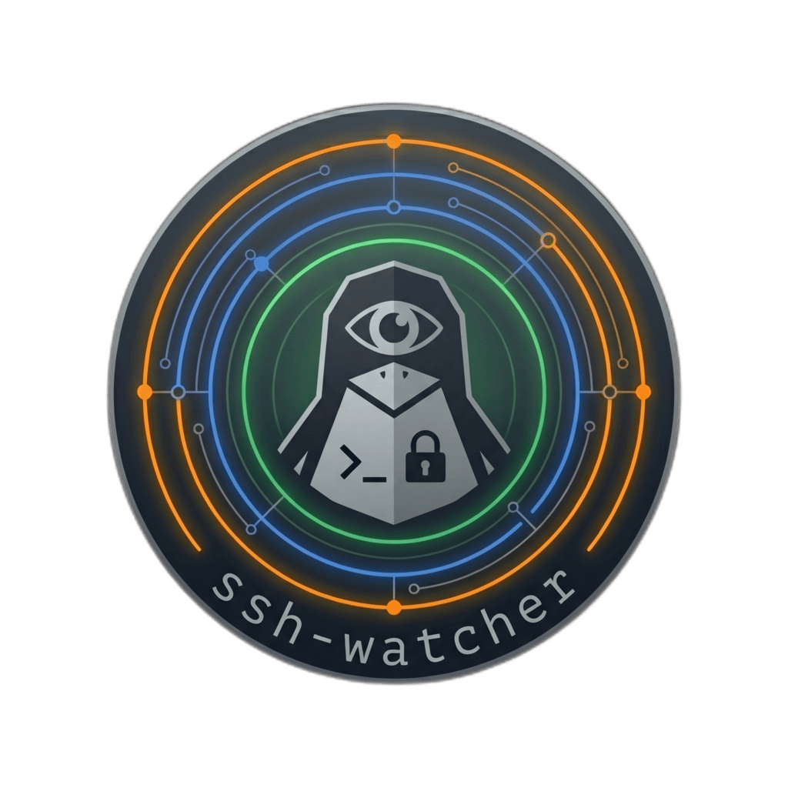

<p align="center">
  
</p>

# ssh-watcher


[](https://github.com/moldabekov/ssh-watcher/actions/workflows/release.yml)


A Linux and macOS daemon that monitors incoming SSH connections and alerts you through desktop notifications, log files, and webhooks. Written in Zig with an eBPF-first detection approach on Linux and an `os_log`-stream approach on macOS.

## Features

- **7 detection backends** with automatic per-OS selection:
  - **Linux: eBPF** (preferred) – kernel tracepoints, zero sshd configuration, lowest overhead
  - **Linux: systemd journal** – parses sshd log entries in real time
  - **Linux: log file tailing** – inotify-based watching of `/var/log/secure` or `/var/log/auth.log`
  - **Linux: utmp** – polls login session records
  - **macOS: log stream** (preferred) – subscribes to `os_log`-native sshd messages via the `log` command
  - **macOS: OpenBSM audit** – `/dev/auditpipe` consumer (stub; full impl pending API verification)
  - **macOS: utmpx** – polls the BSD utmpx database (deprecated on macOS 10.9+ but kept as fallback)
- **3 notification sinks**, each in its own thread:
  - **Desktop notifications** – D-Bus with fork+setuid for root-to-user delivery on Linux; `osascript display notification` on macOS
  - **JSON log file** – one event per line, includes detection backend, `jq`-friendly
  - **Webhooks** – HTTP POST to Slack, Discord, Telegram, or any endpoint with retry
- **Human-readable notification titles** – "SSH: Authentication Successful", "SSH: Connection Disconnected"
- **Layered TOML config** – system-wide defaults + per-user overrides
- **Configurable events** – choose which events to notify on (connection, auth success/failure, disconnect)
- **Configurable urgency** – set notification urgency per event type
- **Notification templates** – customize title and body with `{event_type}`, `{username}`, `{source_ip}`, etc.
- **Systemd integration** – `sd_notify` readiness, `SIGHUP` config reload, `SIGUSR1` status dump

## Download

Pre-built binaries and packages from [GitHub Releases](https://github.com/moldabekov/ssh-watcher/releases):

| Asset | Type | Runtime deps |
|-------|------|-------------|
| `ssh-watcher-static_VERSION_amd64.deb` | Debian/Ubuntu package | None (static) |
| `ssh-watcher-static-VERSION-1.x86_64.rpm` | Fedora/RHEL package | None (static) |
| `ssh-watcher_VERSION_amd64.deb` | Debian/Ubuntu package | libsystemd0, libbpf1 |
| `ssh-watcher-VERSION-1.x86_64.rpm` | Fedora/RHEL package | systemd-libs, libbpf |
| `ssh-watcher-x86_64-linux-static` | Static binary (musl) | None |
| `ssh-watcher-x86_64-linux` | Dynamic binary (glibc) | libsystemd, libbpf |
| `ssh-watcher-x86_64-macos` | Intel macOS binary (ad-hoc signed) | macOS 11+ |
| `ssh-watcher-aarch64-macos` | Apple Silicon macOS binary (ad-hoc signed) | macOS 11+ |

## Requirements

### Build (Linux)

- Zig 0.15.2+
- clang (for BPF compilation)
- libbpf-devel
- systemd-devel (or elogind-dev on musl systems)
- bpftool (for generating `vmlinux.h`, optional – pre-compiled BPF object included)
- upx (for `zig build release` / `zig build release-static` – binary compression)

### Build (macOS)

- Zig 0.15.2+
- Xcode Command Line Tools (provides `libbsm` for the OpenBSM backend and the macOS SDK headers for `utmpx.h`)
- No BPF toolchain required – macOS targets skip the BPF compile step

### Runtime (Linux)

- Linux kernel 5.8+ with BTF (`/sys/kernel/btf/vmlinux`) for eBPF backend
- systemd for journal backend
- `/var/log/secure` or `/var/log/auth.log` for logfile backend

### Runtime (macOS)

- macOS 11+ (log stream, OpenBSM, utmpx)
- Root privileges (required for `log stream --process sshd` and `/dev/auditpipe`)
- A logged-in user session for `osascript` desktop notifications (LaunchDaemons have no session by default)

## Building

```bash
# Generate BTF header (one time, optional – pre-compiled .bpf.o is included)
bpftool btf dump file /sys/kernel/btf/vmlinux format c > bpf/vmlinux.h

# Dev build
zig build

# Run tests
zig build test

# Production build (ReleaseSmall + LTO + strip + UPX)
zig build release

# Fully static musl build (needs musl sysroot with static libs)
zig build release-static -Dmusl-sysroot=/path/to/sysroot

# macOS release (both x86_64 and aarch64 in one invocation, no UPX)
zig build release-macos
```

## Installation

### From packages

```bash
# Debian/Ubuntu
sudo dpkg -i ssh-watcher_*_amd64.deb
sudo systemctl enable --now ssh-watcher

# Fedora/RHEL
sudo rpm -i ssh-watcher-*.x86_64.rpm
sudo systemctl enable --now ssh-watcher
```

### From source (Linux)

```bash
zig build
sudo ./install.sh
sudo systemctl enable --now ssh-watcher
```

### From source (macOS)

```bash
zig build release-macos
sudo ./install.sh
sudo launchctl load /Library/LaunchDaemons/com.moldabekov.ssh-watcher.plist
```

`install.sh` detects `uname -s` and picks per-platform targets:

- **Linux**: binary to `$PREFIX/bin`, config to `$SYSCONFDIR/ssh-watcher`, systemd unit to `$SYSTEMDDIR`; reloads systemd if live.
- **macOS**: binary to `/usr/local/bin`, config to `/etc/ssh-watcher`, launchd plist to `/Library/LaunchDaemons`; ad-hoc codesigns the binary so Gatekeeper accepts it.

### macOS security notes

- **SIP (System Integrity Protection)** does not block `log stream` or `utmpx`, but accessing `/dev/auditpipe` requires root and SIP-permitted entitlements (the OpenBSM backend ships as a stub for this reason).
- **TCC (Transparency, Consent, Control)** — a LaunchDaemon has no user session, so `osascript display notification` requires a logged-in Aqua user. If no one is logged in, the desktop sink logs a warning and stays idle.
- **Gatekeeper** — binaries built by the release workflow are ad-hoc signed (`codesign --sign -`). This avoids the "cannot be opened because the developer cannot be verified" warning on first run. Full notarization is out of scope.

## Configuration

System-wide config at `/etc/ssh-watcher/config.toml`, per-user overrides at `~/.config/ssh-watcher/config.toml`.

```toml
[detection]
# Linux values: "auto", "ebpf", "journal", "logfile", "utmp"
# macOS values: "auto", "logstream", "audit_bsm", "utmpx_bsd"
backend = "auto"
ssh_port = 22
auth_timeout_seconds = 30   # for logfile/journal/logstream/utmpx auth_failure inference

[events]
notify_on_connection = false
notify_on_auth_success = true
notify_on_auth_failure = true
notify_on_disconnect = false

[desktop]
enabled = true
urgency_connection = "low"       # "low", "normal", "critical"
urgency_success = "normal"
urgency_failure = "critical"
urgency_disconnect = "low"
title_template = "SSH: {event_type}"
body_template = "{username}@{source_ip}:{source_port}"

[log]
enabled = false
path = "/var/log/ssh-watcher.log"

[webhook]
enabled = false

[[webhook.endpoints]]
url = "https://hooks.slack.com/services/..."
timeout_seconds = 5
max_retries = 3
payload_template = '{"text": "SSH {event_type}: {username} from {source_ip} on {hostname}"}'
```

### Template variables

`{event_type}`, `{username}`, `{source_ip}`, `{source_port}`, `{timestamp}`, `{session_id}`, `{pid}`, `{hostname}`

### Backend selection

In `auto` mode, the daemon probes backends in priority order and selects the best available. Platform-specific.

**Linux:**

| Priority | Backend | Requirements |
|----------|---------|-------------|
| 1 | eBPF | Kernel 5.8+, BTF, `CAP_BPF` |
| 2 | journal | systemd |
| 3 | logfile | `/var/log/secure` or `/var/log/auth.log` |
| 4 | utmp | Always available (login events only) |

**macOS:**

| Priority | Backend | Requirements |
|----------|---------|-------------|
| 1 | logstream | `/usr/bin/log` (shipped with every macOS install) |
| 2 | audit_bsm | `/dev/auditpipe` + root + SIP-compatible (stub impl) |
| 3 | utmpx_bsd | Always available (deprecated on macOS 10.9+, may emit no events) |

## Usage

### Run directly

```bash
sudo ssh-watcher
```

### Systemd service (Linux)

```bash
sudo systemctl start ssh-watcher
sudo systemctl status ssh-watcher

# View logs
sudo journalctl -u ssh-watcher -f

# Reload config
sudo systemctl reload ssh-watcher

# Status dump
sudo kill -USR1 $(pidof ssh-watcher)
```

### launchd service (macOS)

```bash
# Load and start
sudo launchctl load /Library/LaunchDaemons/com.moldabekov.ssh-watcher.plist

# View logs
tail -f /var/log/ssh-watcher.out /var/log/ssh-watcher.err

# Reload config
sudo launchctl kill SIGHUP system/com.moldabekov.ssh-watcher

# Status dump
sudo launchctl kill SIGUSR1 system/com.moldabekov.ssh-watcher

# Stop and unload
sudo launchctl unload /Library/LaunchDaemons/com.moldabekov.ssh-watcher.plist
```

### Signals

| Signal | Action |
|--------|--------|
| `SIGHUP` | Reload configuration |
| `SIGUSR1` | Dump status to stderr (backend, ring buffer, sessions) |
| `SIGTERM` / `SIGINT` | Graceful shutdown |

## Architecture

```
Detection thread ──writes──> Ring Buffer ──reads──> Desktop sink thread
                                         ──reads──> Log sink thread
                                         ──reads──> Webhook sink thread
```

Single-binary monolith. One detection backend writes `SSHEvent` structs into a broadcast ring buffer (1024 slots). Each notification sink runs in its own thread with an independent consumer cursor. A slow webhook never blocks desktop notifications.

### Desktop notifications

The daemon runs as root but delivers notifications to user desktop sessions:

1. **Same UID** – D-Bus direct connection (daemon running as user)
2. **Cross UID** – fork + setuid to target user, then D-Bus (daemon running as root)
3. **Fallback** – `notify-send` with privilege drop (only if fork fails)

dbus-broker on modern Fedora/systemd rejects cross-UID D-Bus connections, so the fork+setuid approach is necessary when running as root.

### eBPF backend

Four BPF tracepoints compiled with CO-RE (Compile Once, Run Everywhere):

- `tp/sock/inet_sock_set_state` – TCP connection established on SSH port
- `tp/sched/sched_process_fork` – sshd fork chain tracking for PID-to-connection correlation
- `tp/sched/sched_process_exec` – user shell spawned under sshd (auth success)
- `tp/sched/sched_process_exit` – sshd session process exit (disconnect)

A BPF LRU hash map (`conn_map`) propagates client IP/port through sshd's fork chain, enabling accurate per-session correlation even with concurrent connections.

The BPF ELF object is embedded in the binary via `@embedFile` – no external file needed at runtime.

### Journal / logfile backends

Parse sshd log messages with pattern matching:

- `Accepted password for <user> from <ip> port <port>`
- `Accepted publickey for <user> from <ip> port <port>`
- `Failed password for [invalid user] <user> from <ip> port <port>`
- `Disconnected from user <user> <ip> port <port>`
- `Connection closed by [authenticating user <user>] <ip> port <port>`
- `Connection reset by <ip> port <port>`

For journal/logfile backends, connections with no auth event within `auth_timeout_seconds` are inferred as `auth_failure`.

## JSON log format

Each line is a JSON object:

```json
{"timestamp":1776193237140040708,"event_type":"auth_success","source_ip":"192.168.88.18","source_port":55406,"username":"moldabekov","pid":3842338,"session_id":3842338,"backend":"journal","hostname":"web-01"}
```

Parse with `jq`:

```bash
# All auth failures
cat /var/log/ssh-watcher.log | jq 'select(.event_type == "auth_failure")'

# Unique source IPs
cat /var/log/ssh-watcher.log | jq -r '.source_ip' | sort -u

# Events from a specific IP
cat /var/log/ssh-watcher.log | jq 'select(.source_ip == "10.0.0.1")'

# Events by backend
cat /var/log/ssh-watcher.log | jq 'select(.backend == "ebpf")'
```

## Project structure

```
ssh-watcher/
├── build.zig                  # Build script (dev, release, release-static, release-macos)
├── .github/workflows/
│   └── release.yml            # CI: static (Alpine/musl) + dynamic (Ubuntu/glibc) + macOS (universal)
├── bpf/                       # Linux-only
│   ├── ssh_monitor.bpf.c      # BPF tracepoints (C)
│   ├── ssh_monitor.h          # Shared event struct
│   └── vmlinux.h              # Generated kernel BTF header (gitignored)
├── src/
│   ├── main.zig               # Entry point, signal handling, main loop (comptime platform guards)
│   ├── event.zig              # SSHEvent struct, Backend enum (Linux + macOS values)
│   ├── ring_buffer.zig        # Broadcast ring buffer (lock-free, atomic)
│   ├── config.zig             # TOML parser, layered config
│   ├── template.zig           # Notification templates with display names
│   ├── session.zig            # Session correlation table
│   ├── detect/
│   │   ├── backend.zig        # Backend interface and platform-aware probing
│   │   ├── ip.zig             # Shared IPv4 parser (used by both OS backends)
│   │   ├── patterns.zig       # sshd log pattern matcher (shared)
│   │   ├── linux/
│   │   │   ├── ebpf.zig       # eBPF backend (libbpf)
│   │   │   ├── journal.zig    # systemd journal backend
│   │   │   ├── logfile.zig    # Log file tailing backend (inotify)
│   │   │   └── utmp.zig       # utmp polling backend (native struct)
│   │   └── macos/
│   │       ├── logstream.zig  # `log stream --process sshd` consumer
│   │       ├── audit_bsm.zig  # OpenBSM audit backend (stub, API pending)
│   │       └── utmpx.zig      # utmpx polling backend (@cImport utmpx.h)
│   └── notify/
│       ├── sink.zig           # Sink interface
│       ├── logwriter.zig      # JSON log writer (shared)
│       ├── webhook.zig        # Webhook POST with retry (shared)
│       ├── linux/
│       │   ├── dbus.zig       # Minimal D-Bus wire protocol client
│       │   └── desktop.zig    # Desktop notifications (D-Bus + fork+setuid)
│       └── macos/
│           └── desktop.zig    # osascript `display notification` wrapper
├── config/
│   ├── ssh-watcher.toml                   # Example config
│   ├── ssh-watcher.service                # Systemd unit (Linux)
│   └── com.moldabekov.ssh-watcher.plist   # LaunchDaemon plist (macOS)
├── packaging/
│   ├── postinstall.sh         # DEB/RPM post-install (systemctl daemon-reload)
│   └── preremove.sh           # DEB/RPM pre-remove (stop + disable service)
├── nfpm.yaml                  # DEB/RPM package definition
└── install.sh                 # Platform-aware install script (Linux + macOS)
```

## License

MIT
